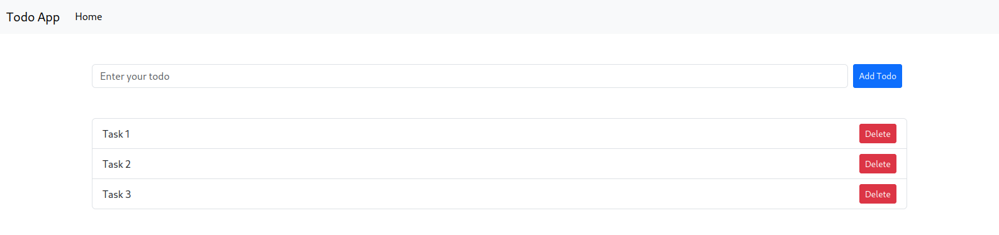

# Cyber-Web-Dev

This repo is a project that was written during the Cyber Web Dev event of IEEE SB Upatras. 
The goal of the project is to create a web application to track tasks, using Node.js, Express.js, Handlebars, and Bootstrap.

## How to run the project

1. Clone the repo
2. Run `npm install`
3. Run `npm start`
4. Open your browser and go to `localhost:3000`


## Steps to create the project

- Step 1
    - Create a folder for the project
    - Run `npm init` to create a package.json file
    - Install express and handlebars
    - `npm install express handlebars`
    - Create an app.js file and add the following code
        ```js
        const express = require('express');
        const app = express();
        app.get('/', (req, res) => {
            res.send('Hello World!');
        });
        app.listen(3000, () => {
            console.log('Example app listening on port 3000!');
        });
        ```
- Step 2
    Add in the app.js file the middlewares we are gonna use and set the view engine as well
    ```js
    app.use(express.static('public'));
    app.set('view engine', 'hbs');
    app.set('views', __dirname + '/views');
    ```
- Step 3 (Create a view)
    - Create a folder called views
    - Create a file called index.hbs
    - Add the following code
        ```html
        <!DOCTYPE html>
        <html lang="en">
        <head>
            <meta charset="UTF-8">
            <meta name="viewport" content="width=device-width, initial-scale=1.0">
            <title>Tasks</title>
        </head>
        <body>
            <h1>Tasks</h1>
        </body>
        </html>
        ```

- Step 4
    - Create a router folder
    - Create a file called index.js (inside the router folder)
    - Add the following code
        ```js
        const express = require('express');
        const router = express.Router();
        router.get('/', (req, res) => {
            res.send('Hello World!');
        });
        module.exports = router;
        ```
    - remove the code from the app.js file
        ```js
        app.get('/', (req, res) => {
            res.send('Hello World!');
        });
        ```
    - and add the following
        ```js
        app.use(require('./routes/index'));
        ```

- Step 5
    - Go to the index.js file inside the router folder
    - Add the following code
        ```js
        router.get('/', (req, res) => {
            res.render('index');
        });
        ```
        and remove 
        ```js
        router.get('/', (req, res) => {
            res.send('Hello World!');
        });
        ```
- Step 6 
    - Play around a bit with bootstrap and html to create a nice view in order to get a 
    better understanding of how it works. Ultimately we need to have a view that looks like this:
    
    - Meaning we need a Navigation Bar (It just for show, we are not gonna use it)
    - A form to add tasks that contains the input and the button
    - A list to show the tasks, each task should have a button to delete it
- Step 7
    - Go to the index.js file in the router folder
    - Change the `res.send` to `res.render('index')`
    - Now after restarting the server it should look like the image at step 6
- Step 7
    - Create o folder called model
    - For simplicity purposes our database thats gonna hold the tasks is just a json but you can use a real database if you want. The kinda of database to use depends on the project you are working on but for this one I would suggest using a mongodb database.
    - Create a file called tasks.json
    - Add the following code
        ```json
        [
            {
                "title": "Task 1",
                "id" : 1,
                "done": false
            }
        ]
        ```
    - Create a file called Todo.js
    - Inside the Todo.js file we are gonna create functions that will be used to manipulate the tasks.json file
    - addTask  
        - This function will add a task to the tasks.json file
        - It will take as an argument the title of the task
    - deleteTask
        - This function will delete a task from the tasks.json file
        - It will take as an argument the id of the task
    - getTasks
        - This function will return all the tasks from the tasks.json file
    - markDone 
        - This function will flip the done property of a task
        - It will take as an argument the id of the task

- Step 8
    - Create a route todo.js
    - Inside the file add the necessary routes to handle the requests
    - We are gonna need 3 routes
        - 1 to add a task
        - 1 to delete a task
        - 1 to mark a task as done
    - For each route we need to call the appropriate function from the Todo.js file

- Final
    - In the end you should have a static web application that can add, delete and mark tasks as done.
    - In order to achieve it you are gonna need to add the buttons to go the the routes you created and also add the necessary code to the routes to handle the requests.

